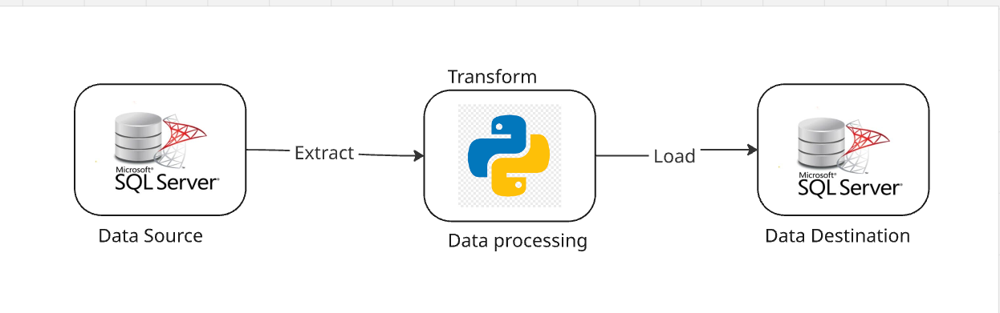
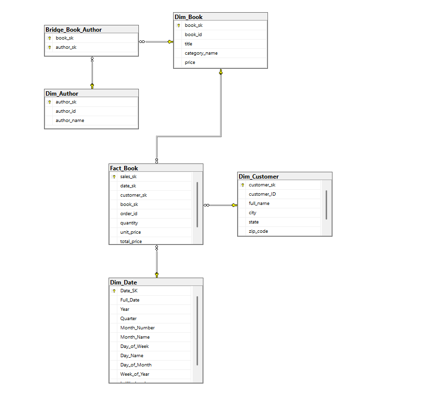

# BookStore Data Warehouse Project 📚📊

A comprehensive End-to-End Data Engineering project that transforms an Operational Database (OLTP) into a Dimensional Model (Star Schema) for analytical purposes.

---

## 🚀 Project Overview

This project demonstrates the transition from a normalized bookstore database to a specialized Data Warehouse (DWH).  
It handles complex data relationships and ensures data integrity for business intelligence reporting.

---

## 🚀 Data Pipeline Architecture



The ETL process:
- **Extracts** data from the source SQL Server  
- **Transforms** it using Python (Pandas)  
- **Loads** the final Star Schema into the Data Warehouse  

---

## 🏗️ Data Modeling Journey

To bridge the gap between operational efficiency and analytical power, this project follows a structured data modeling journey.

### 1️⃣ Source System (OLTP)

The original data resides in a highly normalized relational database (3rd Normal Form).  
This structure is optimized for transactional integrity but complex for direct analytical queries.


---

### 2️⃣ Target System (Star Schema)

The data is transformed into a **Dimensional Model (Star Schema)** optimized for high-performance aggregations and BI reporting.



#### ⭐ Schema Components

- **Fact Table**  
  Maintains the core business measures (Sales) at a granular level.

- **Bridge Table**  
  Resolves the **Many-to-Many** relationship between Books and Authors without causing *row explosion* in the Fact table.

---

## 🔑 Key Technical Features

- **Dimensional Modeling**  
  Designed a complete Star Schema with Fact and Dimension tables.

- **Bridge Table Implementation**  
  Solved the *Multi-valued Dimension* problem where a book can have multiple authors.

- **Surrogate Keys**  
  Used system-generated keys (SKs) for all dimensions to ensure independence from source system changes.

- **Data Cleaning**  
  Implemented logic to handle:
  - Missing data (e.g., city imputation via ZipCode)
  - Unknown members (SK = 0)

---

## 🛠️ Tech Stack

- **Database**: SQL Server (T-SQL)  
- **Language**: Python  
- **Libraries**: Pandas, PyODBC  
- **Environment**: Jupyter Notebooks  

---

## 📂 Project Structure

- `sql/` → DDL scripts for Source and DWH databases  
- `notebooks/` → ETL pipeline logic (Extract, Transform, Load)  
- `docs/` → Mapping sheets and design diagrams  

---

## ⚙️ How to Run

1. Execute the SQL scripts in the `sql/` folder to set up the databases.  
2. Install dependencies:  
   ```bash
   pip install -r requirements.txt